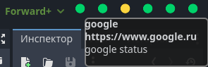
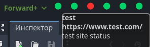

# HealthChecker — Server Monitoring Plugin for Godot

[](https://godotengine.org)
[](https://opensource.org/licenses/MIT)


A Godot plugin that adds a real-time server status monitoring panel with tooltips.  
Easily track server health, detect outages, and visualize infrastructure reliability.




## ✨ Features
- **Real-Time Monitoring**: Automatic server checks with customizable intervals.
- **Configuration**: Easily add/remove servers via a config file.
- **Visual Feedback**:
  - Color-coded statuses (green/yellow/red).
  - Status icons and detailed tooltips.
  - Response time metrics.

## 🛠 Installation
1. Copy the `addons/health_checker` folder into your Godot project.
2. Enable the plugin in **Project → Settings → Plugins**.
3. Edit a `plugin.cfg` file (see **Configuration** below).

## 🚀 Quick Start
1. Add servers to `plugin.cfg`:
```
[plugin]

name="Health Checker Plugin"
description="Server Monitoring Plugin for Godot"
author="garasev"
version="1.0"
script="plugin.gd"

[settings]
check_interval=3

[service1]
url="https://www.google.ru"
title="google"
desc="google status"

[service2]
url="https://www.reddit.com/"
title="reddit"
desc="reddit status"

[service3]
url="https://www.test.com/"
title="test"
desc="test site status"
```
2. The monitoring panel will appear automatically in the Godot editor.

## ⚙️ Configuration
Add entries to `plugin.cfg` with the following parameters:

| Parameter         | Description                          |
|-------------------|-----------------------------------|
| `name`            | Server display name                |
| `url`             | Health check endpoint (GET)       |
| `desc`            | Server display description                |
| `check_interval`  | Check interval in seconds         |

## 🤝 Contributing
- **Report bugs** or request features via [Issues](https://github.com/garasev/HealthChecker/issues).
- **Submit improvements** via Pull Requests.
- **Star the repo** ⭐ to support the project!

## 📜 License
Distributed under the MIT License. See [LICENSE](LICENSE) for details.

---

**Optimized for Godot 4.x** • **Tested on Windows/Linux/macOS**  
